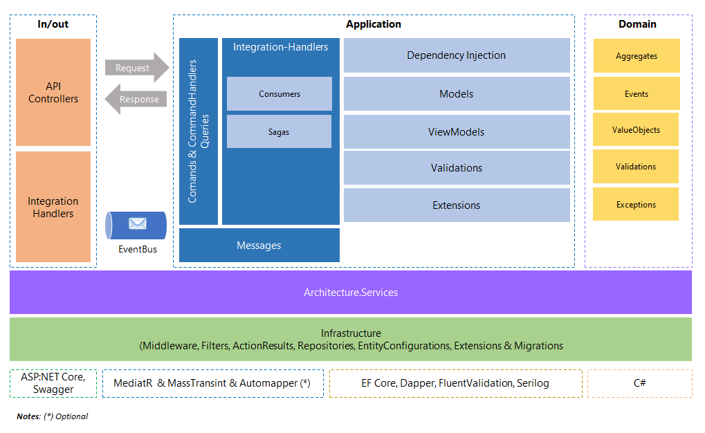

# Microservices
Microservices Patterns and Samples based on: eShopContainer-Ordering: https://github.com/dotnet-architecture/eShopOnContainers/tree/dev/src/Services/Ordering

## Logic Diagram using Domain Driven Design (DDD) and Command & Query Responsability Segregation (CQRS).

